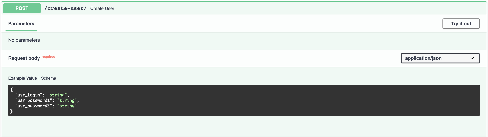
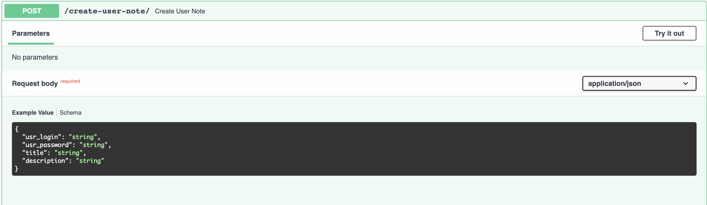
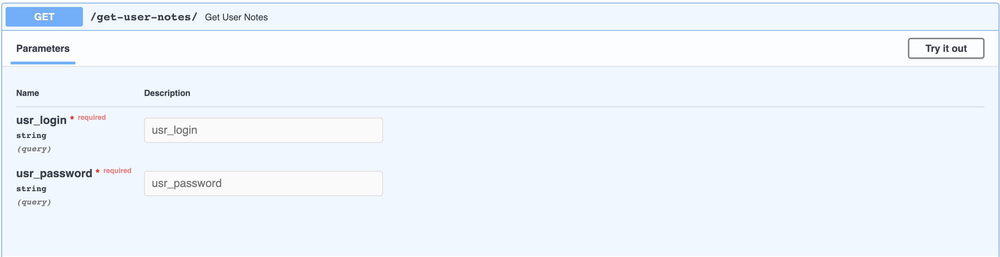
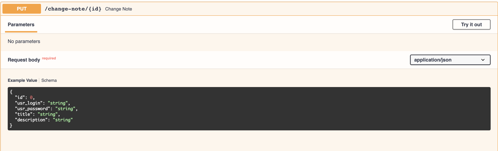
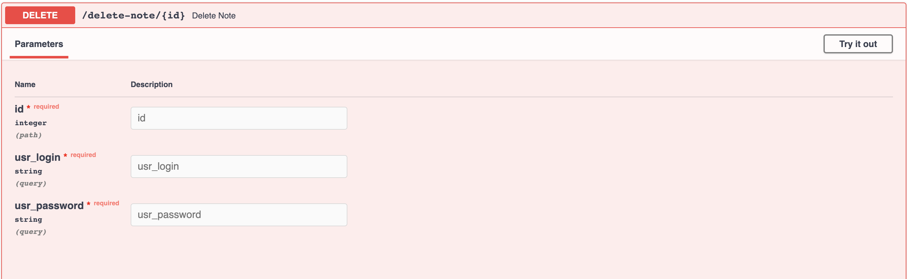

# Fastapi-Notebook

## Want to use this project?

Build the images and run the containers:
```sh
$ docker-compose up -d --build
```

##Api URLS:

* [http://localhost:8000/docs](http://localhost:8000/docs) - Api docs
* [http://localhost:8000/create-user](http://localhost:8000/create-user) - Create a user account
* [http://localhost:8000/create-user-note](http://localhost:8000/create-user-note) - Create note for user
* [http://localhost:8000/get-user-notes](http://localhost:8000/get-user-notes) - Get all user notes
* [http://localhost:8000/change-note/{id}](http://localhost:8000/change-note/{id}) - Change user note by id
* [http://localhost:8000/delete-note/{id}](http://localhost:8000/delete-note/{id}) - Delete user note by id 

##What's Included?
* [PostgreSQL](http://www.postgresql.org/)
* [pgcrypto](https://www.postgresql.org/docs/8.3/pgcrypto.html)
* [FastAPI](https://github.com/tiangolo/fastapi)
* [asyncpg](https://github.com/MagicStack/asyncpg)

##Guide

1. 
    First you need to create a user account.
      
    To do this, you need to follow the link to [create user account](http://localhost:8000/create-user) and enter your login password and password confirmation. 
    The password uses a pattern that prevents the entry of easy passwords. 
    The regex pattern for password:
    ```pythonregexp
    [A-Za-z0-9@#$%^&+=]{8,}
    ```
2.
    After registration, you can create notes. 
    To create notes, you need to specify the login, password, title and description.
    
3. 
    To receive all notes, you need to specify a username and password.
    
4.
    You can also edit and delete user records. 
    To change, you need to specify the record ID, username, password and the changed title and description. 
    Get id by requesting all records.
    
    To delete, you need to specify the id, username and password.
    